# Bloom Boys CRM Database Schema Architecture

This is an architecture document, not a migration. No database code, application code, authentication code, import script, seed script, environment file, or UI has been created.

The schema is opportunity-centered, preserves source provenance, and keeps school interest, division approval, venue approval, and event confirmation separate.

## Conventions

- Primary keys: UUID generated by the database unless stated otherwise.
- User foreign keys reference `profiles(id)`, which is one-to-one with `auth.users(id)`.
- Alex and Sam have identical owner-level permissions in version one. Do not implement admin/member feature restrictions at launch.
- Soft delete/archive: operational records use `archived_at`, `archived_by`, and `archive_reason` unless a table is explicitly immutable.
- Audit: user-visible and business-critical changes write to `audit_log`.
- Import-managed fields are proposed by imports but can become user-editable after review. Future imports must never automatically overwrite a manually edited field.
- Controlled enums should be database enums or constrained lookup tables during implementation.
- Generic `(record_type_id, record_id)` references must be validated by database triggers using `record_type_registry`, or replaced by typed relationship tables before implementation. Integrity cannot be left to frontend code.

## ER Diagram

```mermaid
erDiagram
  auth_users ||--|| profiles : has
  profiles ||--o{ opportunities : owns
  profiles ||--o{ activities : records
  profiles ||--|| profile_preferences : configures
  profiles ||--o{ saved_views : owns
  profiles ||--o{ data_review_items : resolves
  import_batches ||--o{ import_batch_files : runs
  import_batches ||--o{ source_row_versions : observes
  source_files ||--o{ import_batch_files : observed_in
  source_files ||--o{ source_rows : contains
  source_rows ||--o{ source_row_versions : versions
  source_rows ||--o{ import_row_links : links
  source_rows ||--o{ source_records : provides
  source_records ||--o{ source_links : supports
  record_type_registry ||--o{ source_links : validates
  record_type_registry ||--o{ import_row_links : validates
  record_type_registry ||--o{ record_field_state : validates
  organizations ||--o{ organization_aliases : has
  organizations ||--o{ organization_relationships : parent
  organizations ||--o{ organization_relationships : child
  organizations ||--o| venues : may_be
  people ||--o{ contact_roles : holds
  departmental_contacts ||--o{ contact_roles : holds
  organizations ||--o{ contact_methods : has
  people ||--o{ contact_methods : has
  departmental_contacts ||--o{ contact_methods : has
  event_series ||--o{ events : contains
  organizations ||--o{ events : hosts
  venues ||--o{ events : hosts
  events ||--o{ opportunities : relates
  opportunities ||--o{ opportunity_relationships : parent
  opportunities ||--o{ opportunity_relationships : child
  opportunities ||--o{ opportunity_organizations : links
  opportunities ||--o{ opportunity_contacts : links
  opportunities ||--o{ opportunity_approval_items : has
  products ||--o{ opportunity_product_fit : used_by
  opportunities ||--o{ opportunity_product_fit : has
  opportunities ||--o{ opportunity_score_snapshots : has
  opportunities ||--o{ imported_research_scores : preserves
  opportunities ||--o{ activities : timeline
  opportunities ||--o{ tasks : has
  opportunities ||--o{ proposals : has
  partnership_presets ||--o{ proposals : used_by
  proposals ||--o{ proposal_products : includes
  products ||--o{ proposal_products : appears_in
  outreach_templates ||--o{ activities : copied_into
  source_rows ||--o{ data_review_items : raises
  record_type_registry ||--o{ data_review_items : validates
```

## Generic Record Reference Integrity

### `record_type_registry`

- Primary key: `id uuid`.
- Foreign keys: none.
- Unique constraints: `table_name` unique.
- Nullable fields: `description`, `archived_at`.
- Controlled enums: `integrity_strategy` = `validation_trigger`, `typed_table_required`.
- Important indexes: `table_name`, `is_active`.
- Cardinality: one record type validates many generic references.
- Import-managed vs user-editable: system-managed only.
- Archive/soft-delete: archive only after no active generic references use the type.
- Audit requirements: creation, archive, and integrity-strategy changes.

Generic tables store `record_type_id` plus `record_id`. A database trigger must validate that `record_id` exists in the registered table before insert/update. If the implementation does not use validation triggers, generic links must be replaced with typed join tables.

## Core Users

### `profiles`

Purpose: Application profile for Alex and Sam, one-to-one with Supabase `auth.users`.

- Primary key: `id uuid`, also FK to `auth.users(id)`.
- Foreign keys: `id -> auth.users(id)`.
- Unique constraints: `email` unique; `id` unique by PK.
- Nullable fields: `display_name`, `avatar_url`, `last_active_at`, `deactivated_at`, `deactivated_by`, `deactivation_reason`.
- Controlled enums: `status` = `active`, `inactive`; `permission_level` = `owner`.
- Important indexes: `email`, `status`, `permission_level`.
- Cardinality: one auth user has exactly one profile; one profile owns many records and actions.
- Import-managed vs user-editable: never import-managed from research CSVs; user/account managed.
- Archive/soft-delete: no hard delete; set `status = inactive` and `deactivated_at`.
- Audit requirements: status, permission level, display name, and deactivation changes.

Ownership fields on opportunities, tasks, activities, proposals, score overrides, products, and audit entries reference `profiles`. Alex and Sam have identical owner-level permissions.

Alex and Sam sign into separate accounts. The UI must not include profile-switching. Actions use the logged-in `profiles.id` automatically, while owner filters may show All, Alex, Sam, or Unassigned.

Do not add `profiles.owner_key` in version one unless a concrete workflow later requires a stable non-display owner code. Use `profiles.id` as the stable identity, `profiles.display_name` for display, and `profiles.email` for account communication.

### `profile_preferences`

Purpose: Lightweight per-profile display preferences for the signed-in user.

- Primary key: `id uuid`.
- Foreign keys: `profile_id -> profiles(id)` unique.
- Unique constraints: one preference row per profile.
- Nullable fields: `other_display_preferences`, `updated_at`.
- Controlled enums: `table_density` = `comfortable`, `compact`; `default_pipeline_view` = `table`, `kanban`; `sidebar_state` = `expanded`, `collapsed`.
- Required fields: `profile_id`, `table_density`, `default_pipeline_view`, `sidebar_state`, `default_active_cycle_year`.
- Important indexes: `profile_id`.
- Cardinality: one profile has one current preferences row.
- Import-managed vs user-editable: user-managed only; never import-managed.
- Archive/soft-delete: none required while the profile is active.
- Audit requirements: optional audit for default active cycle year and default pipeline view changes.

Preferences do not change ownership or permissions. They only control display defaults such as table density, default pipeline view, sidebar state, default active cycle year, and other lightweight display preferences.

### `saved_views`

Purpose: Saved filters, column sets, and sort presets for dense CRM pages.

- Primary key: `id uuid`.
- Foreign keys: `owner_profile_id -> profiles(id) nullable`.
- Unique constraints: active personal view names are unique on `(owner_profile_id, page_type, normalized_view_name)` where `owner_profile_id is not null` and the view is not archived; active shared view names are unique on `(page_type, normalized_view_name)` where `owner_profile_id is null` and the view is not archived.
- Nullable fields: `owner_profile_id` for shared views, `description`, archive fields.
- Controlled enums: `page_type` = `dashboard`, `research`, `pipeline`, `organizations`, `contacts`, `events`, `tasks`, `proposals`, `templates`, `data_review`; `visibility` = `personal`, `shared`; `status` = `active`, `archived`.
- Required fields: `page_type`, `view_name`, `filter_json`, `column_configuration`, `sort_configuration`, `visibility`, `is_default`.
- Important indexes: owner profile, page type, visibility, default status.
- Cardinality: one profile can own many saved views; shared views have no owner profile and are available to both Alex and Sam.
- Import-managed vs user-editable: seeded defaults plus user-created views; not research-import managed.
- Archive/soft-delete: archive instead of delete when a view may be referenced by preferences or audit.
- Audit requirements: create, update, archive, default changes.

Initial seeded shared views: Tier 1 not contacted, Saskatoon 2027, Follow-ups due, Overdue, Waiting for approval, Unassigned opportunities, Venue opportunities.

## Import and Provenance

### `import_batches`

- Primary key: `id uuid`.
- Foreign keys: `created_by -> profiles(id) nullable`.
- Unique constraints: optional unique `batch_key` for repeatable run labels.
- Nullable fields: `completed_at`, `created_by`, `notes`, `error_summary`.
- Controlled enums: `import_mode` = `dry_run`, `evidence_load`, `canonical_import`; `status` = `planned`, `running`, `completed`, `failed`, `cancelled`, `rolled_back`.
- Required fields: `import_mode`, `status`, `started_at`.
- Important indexes: `import_mode`, `status`, `started_at`, `created_by`.
- Cardinality: one batch has many import batch files.
- Import-managed vs user-editable: import-managed; notes user-editable.
- Archive/soft-delete: immutable operational record; no soft delete.
- Audit requirements: status transitions and failure notes.

### `source_files`

- Primary key: `id uuid`.
- Foreign keys: none.
- Unique constraints: `(phase_folder, relative_csv_path)`.
- Nullable fields: `workbook_sheet`, `last_seen_batch_id`, `backup_zip_file`, `notes`.
- Controlled enums: `phase_folder` = `phase-1`, `phase-2`; `source_kind` = `unpacked_csv`; `backup_status` = `not_checked`, `matches_backup`, `backup_missing`, `backup_differs`.
- Important indexes: `phase_folder`, `relative_csv_path`, `current_file_hash`, `header_hash`.
- Cardinality: one canonical source file appears in many import batches and contains many source rows.
- Import-managed vs user-editable: import-managed only.
- Archive/soft-delete: mark inactive if source file is removed; do not delete history.
- Audit requirements: file hash changes, header mismatch, backup mismatch, activation/inactivation.

ZIP files are backup packages only and are not source files for import.

### `import_batch_files`

- Primary key: `id uuid`.
- Foreign keys: `import_batch_id -> import_batches(id)`, `source_file_id -> source_files(id)`.
- Unique constraints: `(import_batch_id, source_file_id)`.
- Nullable fields: `xlsx_row_count`, `xlsx_column_count`, `headers_match`, `notes`.
- Controlled enums: `file_status` = `seen`, `unchanged`, `changed`, `missing`, `failed_validation`.
- Important indexes: import batch, source file, file status.
- Cardinality: many-to-many run observation between import batches and canonical source files.
- Import-managed vs user-editable: import-managed.
- Archive/soft-delete: immutable run evidence.
- Audit requirements: validation failures and status changes.

### `source_rows`

- Primary key: `id uuid`.
- Foreign keys: `source_file_id -> source_files(id)`, `first_seen_batch_id -> import_batches(id)`, `last_seen_batch_id -> import_batches(id)`.
- Unique constraints: `(source_file_id, source_row_number)` and `(source_file_id, original_record_id)` where original ID exists.
- Nullable fields: `original_record_id`, `parse_status`, `issue_status`, `last_seen_batch_id`.
- Controlled enums: `parse_status` = `pending`, `parsed`, `parsed_with_issues`, `skipped`, `failed`; `issue_status` = `none`, `warning`, `error`, `review_required`.
- Important indexes: `source_file_id`, `original_record_id`, `current_row_hash`, `parse_status`, `last_seen_batch_id`.
- Cardinality: one source row may link to many normalized records through `import_row_links`.
- Import-managed vs user-editable: import-managed stable logical row identity; raw values are immutable in `source_row_versions`.
- Archive/soft-delete: no delete; preserve forever.
- Audit requirements: parse status, issue status, row hash changes, first/last seen batch.

The same unchanged source row resolves to the same `source_rows.id` across import batches.

`source_rows.current_row_hash` is only the latest convenience pointer. Earlier raw values must never be overwritten; each observed version belongs in `source_row_versions`.

### `source_row_versions`

Purpose: Immutable observed raw values for a stable `source_rows` identity in a specific import batch.

- Primary key: `id uuid`.
- Foreign keys: `source_row_id -> source_rows(id)`, `import_batch_id -> import_batches(id)`, `previous_source_row_version_id -> source_row_versions(id) nullable`.
- Unique constraints: `(source_row_id, import_batch_id)` for one observation of a logical row per batch.
- Nullable fields: `previous_source_row_version_id`.
- Required fields: `id`, `source_row_id`, `import_batch_id`, `raw_values_json`, `row_hash`, `observed_at`, `change_status`.
- Controlled enums: `change_status` = `new`, `unchanged`, `changed`, `missing_from_latest`, `retired`.
- Important indexes: `source_row_id`, `import_batch_id`, `row_hash`, `change_status`, `observed_at`, `previous_source_row_version_id`.
- Cardinality: one stable source row has many immutable source row versions; one import batch observes many source row versions.
- Import-managed vs user-editable: import-managed only; never user-editable.
- Archive/soft-delete: no archive and no hard delete; preserve forever.
- Audit requirements: creation only; corrections require a new version linked to a later import batch.

Earlier `source_row_versions` rows are immutable. When a CSV row changes, the importer inserts a new `source_row_versions` row and links it to the previous observed version where useful.

### `import_row_links`

- Primary key: `id uuid`.
- Foreign keys: `source_row_id -> source_rows(id)`, `record_type_id -> record_type_registry(id)`.
- Unique constraints: `(source_row_id, record_type_id, record_id, link_type)`.
- Nullable fields: `record_id` may be temporarily nullable while a review item is pending; `notes`.
- Controlled enums: `link_type` = `created`, `updated`, `supported`, `conflicted`, `skipped`, `review_only`.
- Important indexes: `source_row_id`, `(record_type_id, record_id)`, `link_type`.
- Cardinality: many source rows can support many normalized records.
- Import-managed vs user-editable: import-created; review notes user-editable.
- Archive/soft-delete: no hard delete; mark link type or review status if invalidated.
- Audit requirements: link creation, target changes, invalidation.

Database trigger must validate `(record_type_id, record_id)` against `record_type_registry`.

### `source_records`

- Primary key: `id uuid`.
- Foreign keys: `source_row_id -> source_rows(id) nullable`.
- Unique constraints: optional `(source_url, date_verified, source_text_hash)`.
- Nullable fields: `source_row_id`, `source_url`, `source_text`, `date_verified`, `verified_by`, `notes`.
- Controlled enums: `source_type` = `official_site`, `directory`, `policy`, `event_page`, `staff_page`, `venue_page`, `internal_note`, `csv_row`, `other`; `confidence_level` = `high`, `medium`, `low`, `unverified`; `historical_status` = `current`, `historical`, `estimated`, `unknown`, `conflicting`.
- Important indexes: `source_url`, `date_verified`, `confidence_level`, `source_row_id`.
- Cardinality: one source record can support many normalized records through `source_links`.
- Import-managed vs user-editable: import-created; user may add additional source records.
- Archive/soft-delete: source records are immutable evidence; corrections create new records.
- Audit requirements: creation and correction/supersession notes.

### `source_links`

- Primary key: `id uuid`.
- Foreign keys: `source_record_id -> source_records(id)`, `record_type_id -> record_type_registry(id)`.
- Unique constraints: `(source_record_id, record_type_id, record_id, field_name)`.
- Nullable fields: `field_name`, `notes`.
- Controlled enums: `support_type` = `primary`, `additional`, `conflicting`, `historical_context`, `verification`, `import_origin`.
- Important indexes: `source_record_id`, `(record_type_id, record_id)`, `support_type`.
- Cardinality: generic many-to-many source support for organizations, contacts, roles, events, venues, opportunities, policies, research gaps, scores, products, and proposals.
- Import-managed vs user-editable: both import and user-created.
- Archive/soft-delete: no hard delete; conflicting or superseded links remain visible.
- Audit requirements: source-link add/remove and conflict status changes.

Database trigger must validate `(record_type_id, record_id)`.

### `record_field_state`

- Primary key: `id uuid`.
- Foreign keys: `record_type_id -> record_type_registry(id)`, `current_source_record_id -> source_records(id) nullable`, `edited_by -> profiles(id) nullable`.
- Unique constraints: `(record_type_id, record_id, field_name)`.
- Nullable fields: `current_source_record_id`, `edited_by`, `edited_at`, `edit_reason`, `last_imported_value`, `last_imported_at`, `notes`.
- Controlled enums: `import_update_eligibility` = `eligible`, `manual_lock`, `conflict_review_required`, `import_only`, `user_only`; `field_origin` = `imported`, `manual`, `system`, `mixed`.
- Important indexes: `(record_type_id, record_id)`, `field_name`, `manually_edited`, `import_update_eligibility`.
- Cardinality: one normalized field has one state row.
- Import-managed vs user-editable: system-maintained; users set manual edit state indirectly by editing fields.
- Archive/soft-delete: follows target record; preserve history through audit log.
- Audit requirements: manually edited flag, source support, eligibility, and edit reason changes.

This table protects manual CRM edits. Future imports never automatically overwrite fields where `manually_edited = true`.

### `field_conflicts`

- Primary key: `id uuid`.
- Foreign keys: `record_type_id -> record_type_registry(id)`, `source_row_id -> source_rows(id) nullable`, `source_record_id -> source_records(id) nullable`, `resolved_by -> profiles(id) nullable`.
- Unique constraints: one open conflict per `(record_type_id, record_id, field_name, source_record_id)`.
- Nullable fields: `source_row_id`, `source_record_id`, `resolved_by`, `resolved_at`, `resolution_note`.
- Controlled enums: `status` = `open`, `accepted_import`, `kept_current`, `manual_value_entered`, `ignored`, `superseded`; `severity` = `low`, `medium`, `high`.
- Important indexes: `(record_type_id, record_id)`, `status`, `field_name`.
- Cardinality: many conflicts can exist for one normalized record.
- Import-managed vs user-editable: import creates; users resolve.
- Archive/soft-delete: resolved conflicts remain for history.
- Audit requirements: every resolution.

Any new import evidence conflicting with a manually edited field creates a conflict, even if the new source is newer or high confidence.

## Organizations and Venues

### Canonical Records

Use these canonical organization/venue records:

- `Saskatchewan Indian Institute of Technologies`; alias `SIIT`
- `Saskatchewan Apprenticeship and Trade Certification Commission`; alias `SATCC`
- `Association of Professional Engineers and Geoscientists of Saskatchewan`; alias `APEGS`
- `Centre for Kinesiology, Health and Sport`; `CKHS Main Gym` as facility subspace/alias
- `Regina Exhibition Association Limited (REAL)` as operator
- `REAL District` as venue complex
- `Queensbury Convention Centre` as a specific venue within REAL District

### `organizations`

- Primary key: `id uuid`.
- Foreign keys: `assigned_owner_id -> profiles(id) nullable`.
- Unique constraints: unique `normalized_name` where not archived; optional unique website per canonical organization after review.
- Nullable fields: `city`, `province`, `website`, `main_approval_route`, `opportunity_notes`, `assigned_owner_id`, `confidence_level`, `date_verified`, `tags`, archive fields.
- Controlled enums: `organization_type` includes school division, school, university, college, polytechnic, faculty, department, student organization, professional body, trades organization, Indigenous education authority, independent school, venue operator, venue complex, venue, facility subspace, community organization, church/parish, government/education authority, other. `status` = `research_only`, `qualified`, `added_to_pipeline`, `archived`, `revisit_later`.
- Important indexes: `normalized_name`, `organization_type`, `city`, `status`, `assigned_owner_id`.
- Cardinality: one organization has many aliases, relationships, roles, events, opportunities, and source links.
- Import-managed vs user-editable: name/type/source-derived fields import-managed until reviewed; notes, status, owner, tags user-editable.
- Archive/soft-delete: set `archived_at`; do not delete if linked to source rows.
- Audit requirements: name/type/status/owner hierarchy and archive changes.

Email and phone values are not stored as canonical live fields here. They live in `contact_methods` owned by the organization.

### `organization_aliases`

- Primary key: `id uuid`.
- Foreign keys: `organization_id -> organizations(id)`, `source_row_id -> source_rows(id) nullable`.
- Unique constraints: unique `normalized_alias`.
- Nullable fields: `source_row_id`, `notes`.
- Controlled enums: `alias_type` = `abbreviation`, `punctuation_variant`, `former_name`, `operator_variant`, `facility_subspace`, `provisional_label`, `manual`; `review_status` = `pending`, `approved`, `rejected`, `superseded`.
- Important indexes: `normalized_alias`, `organization_id`, `review_status`.
- Cardinality: many aliases to one organization.
- Import-managed vs user-editable: import suggests; users approve/reject.
- Archive/soft-delete: rejected/superseded via status, not deleted.
- Audit requirements: approval, rejection, canonical target changes.

### `organization_relationships`

- Primary key: `id uuid`.
- Foreign keys: `parent_organization_id -> organizations(id)`, `child_organization_id -> organizations(id)`, `source_record_id -> source_records(id) nullable`.
- Unique constraints: `(parent_organization_id, child_organization_id, relationship_type)` while active.
- Nullable fields: `start_date`, `end_date`, `source_record_id`, `notes`.
- Controlled enums: `relationship_type` = `division_school`, `institution_faculty`, `institution_department`, `institution_student_org`, `venue_operator_complex`, `venue_complex_venue`, `venue_facility_subspace`, `authority_member`, `related`, `historical`.
- Important indexes: `parent_organization_id`, `child_organization_id`, `relationship_type`.
- Cardinality: many-to-many hierarchy graph.
- Import-managed vs user-editable: import-managed with user review for unresolved links.
- Archive/soft-delete: use `end_date` or archive fields.
- Audit requirements: hierarchy additions, removals, and relationship type changes.

Use `organizations` plus `organization_relationships` for venue operators, venue complexes, venues, and facility subspaces in version one. Do not add `venue_spaces` unless the existing hierarchy model cannot represent an approved workflow.

### `venues`

- Primary key: `id uuid`.
- Foreign keys: `organization_id -> organizations(id)` unique, `venue_operator_organization_id -> organizations(id) nullable`.
- Unique constraints: one venue extension per venue organization.
- Nullable fields: address, operator, policy fields, fees, loading, source notes, archive fields.
- Controlled enums: `approval_required` = `yes`, `no`, `unknown`, `event_specific`; `outside_vendor_status` = `allowed`, `restricted`, `unknown`, `blocked`, `requires_written_approval`.
- Important indexes: `organization_id`, `venue_operator_organization_id`, `approval_required`.
- Cardinality: one venue is one organization; one operator may operate many venues.
- Import-managed vs user-editable: import-managed policy fields; user-editable operational notes.
- Archive/soft-delete: archive venue extension with organization.
- Audit requirements: operator, approval, exclusivity, insurance, and outside-vendor changes.

## Contacts and Roles

### `people`

- Primary key: `id uuid`.
- Foreign keys: none required.
- Unique constraints: none automatic; duplicate review handles people.
- Nullable fields: `first_name`, `last_name`, `notes`, archive fields.
- Controlled enums: none beyond archive status if implemented.
- Important indexes: `normalized_full_name`, `last_name`.
- Cardinality: one person can have many contact roles and contact methods.
- Import-managed vs user-editable: import creates candidate identity; users can correct names.
- Archive/soft-delete: archive, do not delete if linked to source rows or activity.
- Audit requirements: name corrections and merges.

### `departmental_contacts`

- Primary key: `id uuid`.
- Foreign keys: `organization_id -> organizations(id) nullable`.
- Unique constraints: `(organization_id, normalized_display_name, department)` while active.
- Nullable fields: `department`, `organization_id`, `purpose`, `notes`, archive fields.
- Controlled enums: none required.
- Important indexes: `organization_id`, `normalized_display_name`, `department`.
- Cardinality: one department contact has many roles and contact methods.
- Import-managed vs user-editable: import-created and user-editable after review.
- Archive/soft-delete: archive, never merge into `people`.
- Audit requirements: organization link, display name, archive, and merge-review decisions.

Departmental contacts cannot be merged into named people. A shared departmental email does not make separate people duplicates.

### `contact_methods`

- Primary key: `id uuid`.
- Foreign keys: nullable owner FKs with check constraint: exactly one of `organization_id`, `person_id`, `departmental_contact_id`, or `contact_role_id` is non-null. Each FK references its named table.
- Unique constraints: `(method_type, normalized_value, owner_scope)` after review; do not globally unique shared phones/emails.
- Nullable fields: raw value, parsed value, extension, source, verification fields, archive fields.
- Controlled enums: `method_type` = `email`, `phone`, `url`, `linkedin`, `contact_form`, `social`, `other`; `status` = `verified_personal_email`, `verified_departmental_email`, `general_organization_email`, `inferred_not_verified`, `not_publicly_available`, `verified_phone`, `unverified`, `status_note`.
- Important indexes: `normalized_value`, `method_type`, all owner FKs, `status`.
- Cardinality: one owner has many contact methods; one method row has one owner.
- Import-managed vs user-editable: import-managed parsed/status values; users can add verified methods.
- Archive/soft-delete: archive old methods; do not overwrite with lower-confidence imports.
- Audit requirements: add/edit/archive, status changes, verification changes.

### `contact_roles`

- Primary key: `id uuid`.
- Foreign keys: exactly one contact subject: `person_id -> people(id)` or `departmental_contact_id -> departmental_contacts(id)`. Scope FKs are optional but at least one of `organization_id`, `event_id`, `venue_id`, or `opportunity_id` must be present.
- Unique constraints: active role uniqueness should use real nullable FKs, such as `(person_id, organization_id, event_id, venue_id, opportunity_id, role_title)` where `person_id is not null`, and `(departmental_contact_id, organization_id, event_id, venue_id, opportunity_id, role_title)` where `departmental_contact_id is not null`.
- Nullable fields: any scope FK not applicable; department, role title, usefulness fields, opening angle, archive fields.
- Controlled enums: `contact_category`, `operational_or_influence_status` = `operational`, `influence`, `referral`, `senior_escalation`, `unknown`; `expected_usefulness` = `very_strong`, `strong`, `moderate`, `low`, `unknown`; `current_status` = `current`, `historical`, `unverified`, `archived`.
- Important indexes: subject FK, organization_id, event_id, venue_id, opportunity_id, category, usefulness.
- Cardinality: one person/department contact can hold many scoped roles.
- Import-managed vs user-editable: import-managed role facts; users can update current status and notes.
- Archive/soft-delete: archive role; preserve historical roles.
- Audit requirements: role scope, authority/usefulness changes, archive.

Referential integrity is enforced with real nullable FKs plus database check constraints for exactly one subject and at least one scope. No unbounded polymorphic relationship is required for contact-role scope.

## Products

### `products`

- Primary key: `id uuid`.
- Foreign keys: `created_by -> profiles(id) nullable`, `archived_by -> profiles(id) nullable`.
- Unique constraints: unique `normalized_name` where not archived.
- Nullable fields: description, created_by, archived_by, archived_at, archive_reason.
- Controlled enums: `status` = `active`, `archived`.
- Important indexes: `normalized_name`, `status`.
- Cardinality: one product can appear in many opportunity product-fit rows and proposal product rows.
- Import-managed vs user-editable: seeded at setup; Alex and Sam can add/archive products with identical owner-level permissions.
- Archive/soft-delete: archive instead of delete if referenced.
- Audit requirements: create, rename, archive, restore.

Seed active products: Flowers, Teddy bears, Kuki beads, Necklaces, Frames, Shirts, Branded gifts, Preorder bundles, School-branded apparel.

## Events, Opportunities, and Approvals

### `event_series`

- Primary key: `id uuid`.
- Foreign keys: `primary_organization_id -> organizations(id)`, `default_venue_id -> venues(id) nullable`.
- Unique constraints: `(primary_organization_id, normalized_series_name)` while active.
- Nullable fields: default venue, notes, archive fields.
- Controlled enums: `series_type` = `school_graduation`, `convocation`, `faculty_ceremony`, `awards`, `trade_certification`, `professional_induction`, `student_event`, `venue_event`, `other`.
- Important indexes: primary organization, series type, normalized name.
- Cardinality: one event series has many annual event records.
- Import-managed vs user-editable: import-created; users can edit reusable notes and default relationships.
- Archive/soft-delete: archive only when series is no longer relevant.
- Audit requirements: series name, organization, default venue, archive.

Recurring events such as Holy Cross Graduation must have separate 2026, 2027, and later `events` records linked to the same `event_series`; new years do not overwrite history.

### `events`

- Primary key: `id uuid`.
- Foreign keys: `event_series_id -> event_series(id) nullable`, `organization_id -> organizations(id)`, `parent_organization_id -> organizations(id) nullable`, `venue_id -> venues(id) nullable`.
- Unique constraints: `(event_series_id, event_year)` where series exists; otherwise `(organization_id, normalized_event_name, event_year)`.
- Nullable fields: event date/time, venue, graduate/attendance estimates, existing vendor, source notes, archive fields.
- Controlled enums: `event_type`; `date_status` = `confirmed_date`, `tentative_date`, `historical_date`, `estimated_annual_timing`, `not_publicly_available`, `conflicting`; `event_confirmation_status` = `unknown`, `not_started`, `estimated`, `tentative`, `confirmed`, `passed`, `cancelled`.
- Important indexes: event_year, event_date, organization_id, venue_id, event_confirmation_status.
- Cardinality: one event can relate to many opportunities; one event belongs to one organization and optionally one series.
- Import-managed vs user-editable: import-managed event facts; users can confirm/correct current-year facts.
- Archive/soft-delete: archive event, but never delete historical event records.
- Audit requirements: date, venue, confirmation status, graduates/attendance, existing vendor.

Version one uses the single nullable `events.venue_id` foreign key. Do not add `event_venues` unless multiple simultaneous venues per annual event are explicitly approved later.

### `opportunities`

- Primary key: `id uuid`.
- Foreign keys: `primary_organization_id -> organizations(id)`, `parent_organization_id -> organizations(id) nullable`, `related_event_id -> events(id) nullable`, `related_venue_id -> venues(id) nullable`, `assigned_owner_id -> profiles(id) nullable`, `main_contact_role_id -> contact_roles(id) nullable`, `backup_contact_role_id -> contact_roles(id) nullable`, `partnership_preset_id -> partnership_presets(id) nullable`.
- Unique constraints: `(primary_organization_id, normalized_opportunity_name, active_cycle_year)` while active.
- Nullable fields: parent organization, event, venue, owner, contacts, next action, follow-up, preset, archive fields.
- Controlled enums: `opportunity_type`; `research_status` = `research_only`, `qualified`, `added_to_pipeline`, `archived`, `revisit_later`; `pipeline_stage` includes research only, ready for outreach, initial contact sent, follow-up due, response received, verbal interest, intro call or meeting, information gathering, proposal in preparation, proposal sent, school approval pending, division approval pending, venue approval pending, procurement or contract review, confirmed, declined, no response, revisit next year; `outreach_path` = `school_first`, `division_first`, `venue_first`, `relationship_first`, `mixed`, `unknown`.
- Important indexes: owner, active cycle year, pipeline stage, research status, score, tier, organization, event.
- Cardinality: central record; one opportunity links to many organizations, contacts, approval items, product-fit rows, scores, activities, tasks, proposals, and related opportunities.
- Import-managed vs user-editable: research fields import-managed; owner/stage/next action/outreach path user-editable.
- Archive/soft-delete: archive; do not delete if it has source rows or activity.
- Audit requirements: owner, stage, approval-affecting fields, score override, archive.

### `opportunity_relationships`

- Primary key: `id uuid`.
- Foreign keys: `parent_opportunity_id -> opportunities(id)`, `child_opportunity_id -> opportunities(id)`, `source_record_id -> source_records(id) nullable`.
- Unique constraints: `(parent_opportunity_id, child_opportunity_id, relationship_type)`.
- Nullable fields: `source_record_id`, `notes`, archive fields.
- Controlled enums: `relationship_type` = `division_unlocks_school`, `venue_relationship_supports_event`, `school_interest_supports_division`, `same_event_series`, `cross_phase_connection`, `related`.
- Important indexes: parent, child, relationship type.
- Cardinality: many-to-many graph between opportunities.
- Import-managed vs user-editable: import can suggest; users approve important strategic relationships.
- Archive/soft-delete: archive or end-date; never delete history.
- Audit requirements: creation, type changes, archive.

A division-wide opportunity can connect to several individual-school opportunities without replacing them. Scores and stages remain independent.

### `opportunity_organizations`

- Primary key: `id uuid`.
- Foreign keys: `opportunity_id -> opportunities(id)`, `organization_id -> organizations(id)`, `source_record_id -> source_records(id) nullable`.
- Unique constraints: `(opportunity_id, organization_id, relationship_type)`.
- Nullable fields: source, notes.
- Controlled enums: `relationship_type` = `primary`, `parent`, `school`, `division`, `institution`, `venue_operator`, `partner`, `approval_authority`, `related`.
- Important indexes: opportunity, organization, relationship type.
- Cardinality: many-to-many.
- Import-managed vs user-editable: import-created; users can add/remove after review.
- Archive/soft-delete: archive link if removed.
- Audit requirements: relationship add/remove/type change.

### `opportunity_contacts`

- Primary key: `id uuid`.
- Foreign keys: `opportunity_id -> opportunities(id)`, `contact_role_id -> contact_roles(id)`, `source_record_id -> source_records(id) nullable`.
- Unique constraints: `(opportunity_id, contact_role_id, role_type)`.
- Nullable fields: source, notes.
- Controlled enums: `role_type` = `main`, `backup`, `decision_maker`, `routing`, `venue`, `procurement`, `referral`, `influence`, `other`.
- Important indexes: opportunity, contact role, role type.
- Cardinality: many-to-many.
- Import-managed vs user-editable: import-created; users select main/backup.
- Archive/soft-delete: archive link if removed.
- Audit requirements: main/backup and role type changes.

### `opportunity_approval_items`

- Primary key: `id uuid`.
- Foreign keys: `opportunity_id -> opportunities(id)`, `authority_organization_id -> organizations(id) nullable`, `evidence_source_id -> source_records(id) nullable`, `updated_by -> profiles(id) nullable`.
- Unique constraints: `(opportunity_id, approval_layer)`.
- Nullable fields: authority, source, updated_by, notes.
- Controlled enums: `approval_layer` = `school_interest`, `school_approval`, `division_approval`, `venue_approval`, `procurement_review`, `contract_signed`, `branding_approval`, `fundraising_revenue_share`, `insurance_confirmed`, `final_operational_approval`; `status` = `not_required`, `unknown`, `not_started`, `in_progress`, `verbal_approval`, `written_approval`, `rejected`, `expired`, `requires_follow_up`.
- Important indexes: opportunity, approval layer, status, authority.
- Cardinality: one opportunity has many approval items.
- Import-managed vs user-editable: import may seed unknowns; users manually update approval status.
- Archive/soft-delete: no delete; status can become expired/not required.
- Audit requirements: every status change.

School interest, school approval, division approval, venue approval, procurement review, branding approval, insurance confirmation, and event confirmation are separate. Verbal interest is not approval.

### `opportunity_product_fit`

- Primary key: `id uuid`.
- Foreign keys: `opportunity_id -> opportunities(id)`, `product_id -> products(id)`, `source_record_id -> source_records(id) nullable`.
- Unique constraints: `(opportunity_id, product_id)`.
- Nullable fields: notes, confidence, source_record_id.
- Controlled enums: `fit_level` = `very_strong`, `strong`, `moderate`, `limited`, `poor`, `unknown`; `approval_requirement` = `not_required`, `unknown`, `required`, `restricted`, `blocked`.
- Important indexes: opportunity, product, fit level.
- Cardinality: one opportunity has many product-fit rows; one product can appear on many opportunities.
- Import-managed vs user-editable: import seeds from product-fit text; users refine.
- Archive/soft-delete: archive fit row if no longer relevant; archived products remain visible historically.
- Audit requirements: fit level, approval requirement, product changes.

## Scoring

### `imported_research_scores`

- Primary key: `id uuid`.
- Foreign keys: `opportunity_id -> opportunities(id)`, `source_file_id -> source_files(id)`, `source_row_id -> source_rows(id)`.
- Unique constraints: `(opportunity_id, source_row_id)`.
- Nullable fields: original scoring notes.
- Controlled enums: `phase` = `phase-1`, `phase-2`.
- Important indexes: opportunity, phase, original score, original tier.
- Cardinality: many imported scores can support one opportunity.
- Import-managed vs user-editable: immutable import-managed.
- Archive/soft-delete: never delete.
- Audit requirements: creation only; corrections require new import/source link.

Original Phase 1 and Phase 2 source records, scores, tiers, and source URLs remain immutable and traceable.

### `opportunity_score_snapshots`

- Primary key: `id uuid`.
- Foreign keys: `opportunity_id -> opportunities(id)`, `calculated_by -> profiles(id) nullable`, `activity_id -> activities(id) nullable`, `stage_history_id -> opportunity_stage_history(id) nullable`.
- Unique constraints: none; append-only history.
- Nullable fields: calculated_by, activity_id, stage_history_id, score cap fields, notes.
- Controlled enums: `confidence_label` = `high`, `medium`, `low`; `calculation_trigger` = `import`, `manual_recalculate`, `research_update`, `outreach_activity`, `stage_change`, `approval_change`, `manual_override_removed`.
- Important indexes: opportunity, calculated_at, confidence, overall score.
- Cardinality: one opportunity has many score snapshots.
- Import-managed vs user-editable: system/import calculated; users can add notes via override process.
- Archive/soft-delete: append-only; no delete.
- Audit requirements: snapshot creation and linked trigger.

Score triggers reference either an activity, a stage-history row, or a controlled trigger enum.

### `opportunity_score_overrides`

- Primary key: `id uuid`.
- Foreign keys: `opportunity_id -> opportunities(id)`, `created_by -> profiles(id)`, `removed_by -> profiles(id) nullable`.
- Unique constraints: one active override per opportunity where `removed_at is null`.
- Nullable fields: removed_by, removed_at, removal_note.
- Controlled enums: none beyond required reason.
- Important indexes: opportunity, created_by, active override.
- Cardinality: one opportunity can have historical overrides, at most one active.
- Import-managed vs user-editable: user-created only.
- Archive/soft-delete: remove by setting removed fields.
- Audit requirements: create/remove override and reason.

## Workflow and CRM Operations

### `opportunity_stage_history`

- Primary key: `id uuid`.
- Foreign keys: `opportunity_id -> opportunities(id)`, `changed_by -> profiles(id)`.
- Unique constraints: none.
- Nullable fields: note.
- Controlled enums: previous/new stage use `pipeline_stage`.
- Important indexes: opportunity, changed_at, changed_by.
- Cardinality: one opportunity has many stage history rows.
- Import-managed vs user-editable: user/system CRM managed, not research-import managed.
- Archive/soft-delete: append-only.
- Audit requirements: every stage change.

### `activities`

- Primary key: `id uuid`.
- Foreign keys: `user_id -> profiles(id)`, `opportunity_id -> opportunities(id) nullable`, `organization_id -> organizations(id) nullable`, `contact_role_id -> contact_roles(id) nullable`, `template_id -> outreach_templates(id) nullable`.
- Unique constraints: none by default.
- Nullable fields: related record FKs, subject, full body, summary, outcome, next action, follow-up, attachment URL.
- Controlled enums: `activity_type` = `email_sent`, `email_received`, `call_attempted`, `call_completed`, `voicemail_left`, `meeting`, `referral`, `follow_up`, `proposal_sent`, `note`, `status_update`, `approval_update`, `task_completed`, `file_added`, `other`; `visibility` = `internal`, `private`.
- Important indexes: opportunity, organization, contact role, user, activity_at, type.
- Cardinality: one opportunity/contact/organization can have many activities.
- Import-managed vs user-editable: user-created; import may create research notes only if approved.
- Archive/soft-delete: archive activity, preserve audit.
- Audit requirements: create/edit/delete/archive.

Version one uses `activities.contact_role_id` as the primary contact link for an activity. Do not add `activity_contacts` until multiple contacts per activity become a real requirement.

### `tasks`

- Primary key: `id uuid`.
- Foreign keys: `assigned_user_id -> profiles(id) nullable`, `created_by -> profiles(id)`, `completed_by -> profiles(id) nullable`, plus nullable scoped FKs: opportunity, organization, contact_role, event, venue, proposal, research_gap.
- Unique constraints: optional partial unique open routine follow-up per `(opportunity_id, task_kind, related_activity_id)` to prevent accidental duplicates.
- Nullable fields: assigned user, due time, completed fields, scoped FKs not applicable.
- Controlled enums: `status` = `open`, `in_progress`, `completed`, `blocked`, `cancelled`; `priority` = `critical`, `high`, `medium`, `low`; `task_kind` = `follow_up`, `research`, `approval`, `proposal`, `call`, `custom`.
- Important indexes: assigned user, status, due date, opportunity, priority.
- Cardinality: one related record can have many tasks.
- Import-managed vs user-editable: user-created; imports can seed research gaps but not routine outreach tasks.
- Archive/soft-delete: cancel/archive instead of delete.
- Audit requirements: assignment, due date, status, completion.

### `research_gaps`

- Primary key: `id uuid`.
- Foreign keys: nullable `organization_id`, `opportunity_id`, `event_id`, `venue_id`, `assigned_owner_id -> profiles(id)`, `resolved_by -> profiles(id)`, `source_added_id -> source_records(id)`.
- Unique constraints: none; possible duplicate review by normalized missing information and organization.
- Nullable fields: most relationship fields, phone, resolution fields, notes.
- Controlled enums: `priority` = `critical`, `high`, `medium`, `low`; `status` = `open`, `assigned`, `contact_attempted`, `waiting_for_response`, `resolved`, `no_public_answer`, `no_longer_relevant`.
- Important indexes: status, priority, assigned owner, organization, opportunity.
- Cardinality: many gaps per record.
- Import-managed vs user-editable: import-created; users resolve/edit.
- Archive/soft-delete: archive only if irrelevant; preserve resolved history.
- Audit requirements: assignment, status, resolution.

### `policies`

- Primary key: `id uuid`.
- Foreign keys: nullable `organization_id`, `venue_id`, `opportunity_id`.
- Unique constraints: `(organization_id, venue_id, policy_type, normalized_policy_name)` where present.
- Nullable fields: any target FK, policy URL, requirements, notes.
- Controlled enums: `policy_type` = `procurement`, `vendor_registration`, `purchasing`, `fundraising`, `sponsorship`, `commercial_activity`, `school_branding`, `logo_use`, `outside_vendor`, `insurance`, `visitor_access`, `criminal_record`, `facility_use`, `revenue_sharing`, `exclusive_contract`, `tender`, `other`; `confidence_level`.
- Important indexes: organization, venue, opportunity, policy type, confidence.
- Cardinality: many policies can support many records through source links.
- Import-managed vs user-editable: import-created; user may add summaries and updates.
- Archive/soft-delete: supersede/archive when outdated.
- Audit requirements: impact, requirements, confidence, archive.

### `proposals`

- Primary key: `id uuid`.
- Foreign keys: `opportunity_id -> opportunities(id)`, `recipient_contact_role_id -> contact_roles(id) nullable`, `created_by -> profiles(id)`, `partnership_preset_id -> partnership_presets(id) nullable`.
- Unique constraints: `(opportunity_id, version)` where version is set.
- Nullable fields: recipient, date sent, terms, attachment/link, next action, follow-up.
- Controlled enums: `status` = `draft`, `internal_review`, `ready_to_send`, `sent`, `viewed_or_acknowledged`, `revision_requested`, `revised`, `accepted`, `rejected`, `expired`.
- Important indexes: opportunity, status, date sent, follow-up.
- Cardinality: one opportunity has many proposals.
- Import-managed vs user-editable: user-created only.
- Archive/soft-delete: archive expired/rejected drafts, preserve sent proposals.
- Audit requirements: status, sent date, terms, file/link changes.

Proposal products are stored in `proposal_products`, not only as free text on the proposal. Proposal terms may summarize the offer, but product rows preserve what was proposed in each version.

In version one, each `proposals` row represents one proposal version using the existing `version` field. Do not add `proposal_versions` unless a clear requirement proves separate version rows are necessary. Keep one primary recipient through `recipient_contact_role_id`; do not add `proposal_recipients` until multiple recipients per proposal become a real requirement. Proposal attachment path or external document link fields on `proposals` are sufficient for the first slice; a normalized `proposal_attachments` table can be introduced later for multiple files, replacement history, or storage audit requirements.

### `proposal_products`

- Primary key: `id uuid`.
- Foreign keys: `proposal_id -> proposals(id)`, `product_id -> products(id) nullable`.
- Unique constraints: optional `(proposal_id, product_id, product_name_snapshot)` while active.
- Nullable fields: `product_id` may be null if the product was archived or recorded as custom text; description/notes, quantity or scope, archive fields.
- Required fields: `proposal_id`, `product_name_snapshot`.
- Controlled enums: `approval_requirement` = `not_required`, `unknown`, `required`, `restricted`, `blocked`.
- Important indexes: proposal, product, approval requirement, archived status.
- Cardinality: one proposal has many proposal product rows; one product can appear on many proposal product rows.
- Import-managed vs user-editable: user-created only during proposal tracking.
- Archive/soft-delete: archive rows instead of deleting; archived historical rows must remain visible on sent, accepted, rejected, expired, and superseded proposals.
- Audit requirements: create, edit, archive, restore, approval-requirement changes.

`product_name_snapshot` preserves the display name used when the proposal version was created, even if the product is later renamed or archived.

### `outreach_templates`

- Primary key: `id uuid`.
- Foreign keys: `created_by -> profiles(id)`, `updated_by -> profiles(id) nullable`, `duplicated_from_template_id -> outreach_templates(id) nullable`.
- Unique constraints: `(category, normalized_name)` while active.
- Nullable fields: subject, optional internal notes, updated_by, duplicated_from, archive fields.
- Controlled enums: `category` = `initial_school_email`, `school_office_routing`, `principal_email`, `division_partnership`, `venue_inquiry`, `follow_up`, `final_follow_up`, `referral_introduction`, `proposal_follow_up`, `revisit_next_year`, `other`; `status` = `active`, `archived`.
- Required fields: name, category, body, status, created_by, created_at.
- Important indexes: category, status, created_by.
- Cardinality: one template can be copied into many activities; duplication creates a new template row.
- Import-managed vs user-editable: user-created only.
- Archive/soft-delete: archive, do not hard delete if used.
- Audit requirements: create, edit, duplicate, copy/use, archive.

Templates explicitly include name, category, subject, body, optional internal notes, status, created ownership, and updated ownership. They support create, edit, duplicate, copy, archive, and category filtering. They never send automatically.

### `partnership_presets`

- Primary key: `id uuid`.
- Foreign keys: `created_by -> profiles(id) nullable`, `updated_by -> profiles(id) nullable`.
- Unique constraints: unique normalized preset name while active.
- Nullable fields: custom terms, share percentages, notes, archive fields.
- Controlled enums: `preset_type` = `catholic_school`, `public_school`, `university_college`, `venue_retail`, `community_event`, `no_revenue_share`, `custom`; `status` = `active`, `archived`.
- Important indexes: preset type, status.
- Cardinality: one preset can be selected by many opportunities/proposals.
- Import-managed vs user-editable: settings/owner managed, not research-import managed.
- Archive/soft-delete: archive old presets; preserve proposal terms already copied.
- Audit requirements: percentages, term wording, archive.

Preset terms are starting points only. All terms remain editable per opportunity or proposal. Catholic school default may start with school 20% net event profit, parish/community 5%, Bloom Boys 75%, but must not automatically appear in public proposals without user review.

Do not add `partnership_preset_products` in version one unless a preset must contain a reusable structured product list. Current presets primarily provide editable partnership and revenue-sharing terms.

## Data Quality and Audit

### `duplicate_candidates`

- Primary key: `id uuid`.
- Foreign keys: `reviewed_by -> profiles(id) nullable`.
- Unique constraints: `(candidate_type, normalized_key)` for open candidates.
- Nullable fields: reviewed fields, decision notes.
- Controlled enums: `candidate_type` = `same_email`, `same_phone`, `same_name_org`, `organization_alias`, `venue_variant`, `trustee_contact_overlap`; `confidence` = `high`, `medium`, `low`; `review_status` = `open`, `merged`, `linked_not_merged`, `not_duplicate`, `deferred`, `superseded`.
- Important indexes: type, confidence, review status.
- Cardinality: many candidates can reference many records through `duplicate_candidate_records`.
- Import-managed vs user-editable: import suggests; users decide.
- Archive/soft-delete: close/supersede, do not delete.
- Audit requirements: review decision and merge/link actions.

### `duplicate_candidate_records`

- Primary key: `id uuid`.
- Foreign keys: `duplicate_candidate_id -> duplicate_candidates(id)`, `record_type_id -> record_type_registry(id)`.
- Unique constraints: `(duplicate_candidate_id, record_type_id, record_id)`.
- Nullable fields: notes.
- Controlled enums: none required.
- Important indexes: candidate, record type/id.
- Cardinality: many records per duplicate candidate.
- Import-managed vs user-editable: import-created.
- Archive/soft-delete: follows candidate.
- Audit requirements: record add/remove.

Database trigger must validate `(record_type_id, record_id)`.

### `unresolved_relationships`

- Primary key: `id uuid`.
- Foreign keys: `source_row_id -> source_rows(id)`, `resolved_by -> profiles(id) nullable`.
- Unique constraints: one open item per `(source_row_id, relationship_field, raw_value)`.
- Nullable fields: suggested target, resolved target, resolved_by, resolved_at, notes.
- Controlled enums: `expected_target_entity`; `status` = `open`, `resolved`, `ignored`, `needs_research`, `superseded`; `severity` = `low`, `medium`, `high`.
- Important indexes: status, expected target, severity.
- Cardinality: many unresolved values per source row.
- Import-managed vs user-editable: import-created; users resolve.
- Archive/soft-delete: resolved/superseded, not deleted.
- Audit requirements: resolution and ignored decisions.

### `data_review_items`

Purpose: Minimal normalized review queue for import issues and cross-queue review items that do not fit only one specialized table.

- Primary key: `id uuid`.
- Foreign keys: `record_type_id -> record_type_registry(id) nullable`, `source_row_id -> source_rows(id) nullable`, `field_conflict_id -> field_conflicts(id) nullable`, `duplicate_candidate_id -> duplicate_candidates(id) nullable`, `unresolved_relationship_id -> unresolved_relationships(id) nullable`, future `source_conflict_id -> source_conflicts(id) nullable when that table is introduced`, `resolved_by -> profiles(id) nullable`.
- Unique constraints: one open item per `(issue_type, source_row_id, record_type_id, record_id, field_name)` where those values exist.
- Nullable fields: `record_id`, `field_name`, source row, raw value, normalized/current value, recommendation, decision notes, resolved fields, detail foreign keys when the issue type does not require them.
- Required fields: `issue_type`, `severity`, `review_status`, `created_at`.
- Controlled enums: `issue_type` = `field_conflict`, `duplicate_warning`, `unresolved_relationship`, `import_issue`, `source_conflict`, `provisional_phase_1_connection`, `other`; `severity` = `low`, `medium`, `high`; `review_status` = `open`, `resolved`, `ignored`, `deferred`, `superseded`.
- Important indexes: issue type, severity, review status, source row, affected record.
- Cardinality: many review items can reference one source row or one affected record.
- Import-managed vs user-editable: imports and audit/reconciliation jobs may create items; Alex or Sam resolves them.
- Archive/soft-delete: resolved/superseded records remain visible for history; no hard delete.
- Audit requirements: every decision, ignore, defer, supersede, and resolved value.

Minimal first-version Data Review must support opening and resolving field conflicts, duplicate warnings, unresolved relationships, and import issues. Specialized tables such as `field_conflicts`, `duplicate_candidates`, and `unresolved_relationships` remain the source of detailed queue data; `data_review_items` can provide a unified worklist and import issue home. Full bulk review tools, advanced alias reconciliation, and deep source comparison can be layered later.

Check constraints must enforce required detail links for detail-backed issue types:

- `issue_type = field_conflict` requires `field_conflict_id` and no other detail FK.
- `issue_type = duplicate_warning` requires `duplicate_candidate_id` and no other detail FK.
- `issue_type = unresolved_relationship` requires `unresolved_relationship_id` and no other detail FK.
- `issue_type = source_conflict` requires `source_conflict_id` once `source_conflicts` exists.
- `issue_type = import_issue`, `provisional_phase_1_connection`, or `other` may use no detail FK, but must still include enough source row, affected record, raw value, or recommendation context to support a decision.

Generic affected-record references remain `record_type_id` plus `record_id` and must be validated at the database layer through `record_type_registry` validation triggers. Integrity must not rely on frontend-only links.

### `audit_log`

- Primary key: `id uuid`.
- Foreign keys: `user_id -> profiles(id) nullable`, `record_type_id -> record_type_registry(id)`.
- Unique constraints: none.
- Nullable fields: user, field name, reason.
- Controlled enums: `action_type` = `create`, `update`, `archive`, `restore`, `merge`, `unlink`, `stage_change`, `approval_change`, `score_override`, `import_update`, `conflict_resolution`.
- Important indexes: user, record type/id, action type, created_at.
- Cardinality: many audit entries per record.
- Import-managed vs user-editable: system-created only.
- Archive/soft-delete: append-only.
- Audit requirements: this is the audit trail.

Database trigger must validate `(record_type_id, record_id)`.
